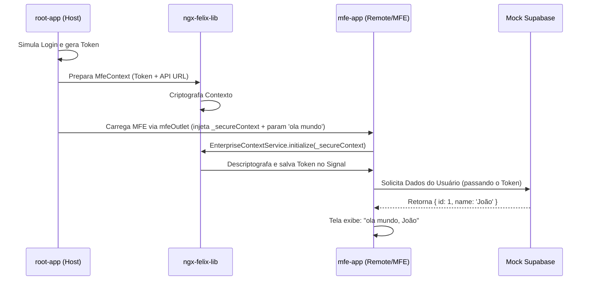

# Product Requirements Document (PRD): Validação da ngx-felix-lib

## 1. Objetivo

Criar duas aplicações Angular independentes (`root-app` e `mfe-app`) para validar e testar a integração, estrutura de comunicação e segurança providas pela biblioteca `ngx-felix-lib` publicada no NPM.

## 2. Escopo do Projeto

### 2.1. Aplicação Root (Host)

- **Localização:** `felix-workspace/projects/root-app`
- **Independência:** Deve ser um workspace Angular isolado, sem vínculos com o `angular.json` ou `package.json` do workspace pai (`felix-workspace`).
- **Responsabilidades:**
  - Instalar `ngx-felix-lib` via NPM (`npm i ngx-felix-lib`).
  - Simular rotinas de autenticação via _Mock_.
  - Gerar e injetar Token JWT fictício e informações de contexto (URL Base da API, etc.).
  - Utilizar a diretiva `mfeOutlet` da `ngx-felix-lib` para carregar o Micro-Frontend remoto.
  - Passar o contexto seguro (criptografado) e um parâmetro estático com o valor `"ola mundo"`.

### 2.2. Aplicação MFE (Remote)

- **Localização:** `felix-workspace/projects/mfe-app`
- **Independência:** Deve ser um workspace Angular isolado, também sem vínculos com o repositório pai.
- **Responsabilidades:**
  - Instalar `ngx-felix-lib` via NPM.
  - Expor um módulo/componente para ser consumido pela arquitetura de Module Federation.
  - Receber os _Inputs_ do Host, como a propriedade `_secureContext` e o parâmetro `"ola mundo"`.
  - Recorrer ao `EnterpriseContextService` para inicializar e descriptografar o contexto provido pelo Host.
  - Utilizar o token interceptado para consumir um _Mock_ de serviço que simula o Supabase.
  - Obter um nome de usuário fictício a partir do serviço Mock e concatená-lo ao parâmetro externo, renderizando na tela o resultado (ex: `"João, ola mundo"` ou `"ola mundo João"`).

## 3. Requisitos Técnicos

- **Angular:** Versão V17+ (preferencialmente V21 alinhado ao workspace atual).
- **Module Federation:** Utilizar `@angular-architects/module-federation` para gestão do carregamento de aplicações remotas e configurações.
- **Crypto-js:** Instalar a lib e seus types para viabilizar as chamadas da `ngx-felix-lib`.
- **Independência:** A remoção das subpastas `root-app` e `mfe-app` não deve acarretar erros na base `felix-workspace`.

## 4. Estrutura de Comunicação

## 5. Critérios de Aceite

- Os dois apps instalam dependências e rodam os servidores localmente sem conflitos.
- O componente do MFE é renderizado dentro da casca da host.
- O Token do Mock do Host está corretamente presente na requisição (ou lógica Mockada) do MFE para a base do Supabase.
- A tela final no Host exibe com sucesso a união da variável do host e variável obtida pelo MFE na API com contexto criptografado.
